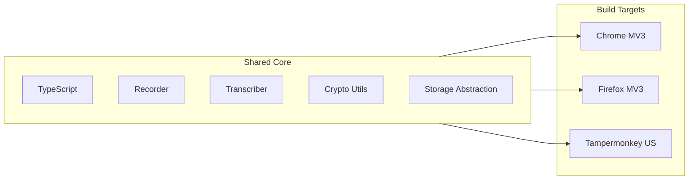

<p align="center">
  <picture>
    <source media="(prefers-color-scheme: dark)" srcset="https://raw.githubusercontent.com/santoni-star/reborn-q/main/assets/logo-dark.svg">
    
  </picture>
</p>

<h1 align="center">🔊 Reborn Q</h1>

<p align="center">
  <em>Voice notes for developers — cross-browser, multi-sync, encrypted</em>
</p>

<p align="center">
  <a href="#-features"><strong>Features</strong></a> ·
  <a href="#-sync-backends"><strong>Sync Backends</strong></a> ·
  <a href="#-getting-started"><strong>Getting Started</strong></a> ·
  <a href="#-security"><strong>Security</strong></a> ·
  <a href="#-cross-browser"><strong>Cross-Browser</strong></a> ·
  <a href="#-contributing"><strong>Contributing</strong></a>
</p>

<p align="center">
  
  
  
  
  
  
  
  
</p>

<hr>

## 🌟 Overview

**Reborn Q** is the public evolution of the Dev Voice Reborn platform — a cross-browser voice note-taking extension for developers. Record bugs, ideas, and architecture decisions with your voice, then sync them seamlessly across every device you use.

Born from the same codebase as Dev Voice Reborn, Reborn Q focuses on **universal accessibility and data sovereignty**: bring your own storage backend, encrypt your own data, and use it in any browser — Chrome, Firefox, or injected via Tampermonkey on any page.

---

## ✨ Features

### 🎤 Instant Voice Capture
One-click recording from the extension popup or via a configurable keyboard shortcut. Your audio is transcribed locally or via your configured backend.

### 🔄 Multi-Backend Sync
Never lose a note. Reborn Q synchronises across **Firebase**, **Google Drive**, and the **local filesystem** — seamlessly and automatically.

| Backend | Online | Offline | Encryption | Notes |
|---------|--------|---------|------------|-------|
| **Firebase** | ✅ | ✅ (queue) | 🔐 AES-256-GCM | Real-time, multi-device |
| **Google Drive** | ✅ | ❌ | 🔐 AES-256-GCM | AppData folder, you own the data |
| **Local File System** | ✅ | ✅ | 🔐 Optional | Raw Markdown files on disk |

### 🛡️ End-to-End Encryption
Your voice notes are encrypted client-side before they ever leave your device. See [Security](#-security) for details.

### 🌐 Cross-Browser
- **Chrome** — Full-featured extension
- **Firefox** — Manifest v3 compatible build
- **Any Page** — Tampermonkey userscript injects the recorder into GitHub, GitLab, Jira, Linear, and more

### 🔧 Tampermonkey Tooling
Inject voice recording into the sites you already work on. Capture context from PRs, tickets, and issues without leaving the page.

### ⚡ Offline-First
Record and transcribe offline. Notes are queued and synced when connectivity resumes. Zero data loss, even on a plane.

### 📁 Local File System Sync
Write notes directly as Markdown files to a folder of your choice. Edit them in your favourite editor, commit them to your repo, or process them with your own pipeline.

---

## 🔄 Sync Backends

### Firebase
The default backend. Real-time synchronisation across all your devices with Firestore. Supports offline write queues and conflict resolution. Ideal for most users.

### Google Drive Sync
Notes are stored in the Google Drive AppData folder — invisible to your normal Drive view but accessible to the extension on any device where you sign in. You own the data; Reborn Q is just the UI.

### Local File System
For the ultimate in data ownership, sync notes as plain Markdown (`.md`) files to a local directory. Compatible with Obsidian, VS Code, Neovim — any editor that understands Markdown. You can version-control your voice notes with git.

---

## 🚀 Getting Started

### Prerequisites

- [Node.js](https://nodejs.org/) ≥ 18.0
- [npm](https://www.npmjs.com/) or [yarn](https://yarnpkg.com/)
- (Optional) A [Firebase](https://firebase.google.com/) project for cloud sync
- (Optional) A Google Cloud OAuth 2.0 client for Drive sync

### Installation

```bash
# Clone the repository
git clone https://github.com/santoni-star/reborn-q.git
cd reborn-q

# Install dependencies
npm install

# Configure
cp .env.example .env.local
# Edit .env.local with your preferred backend settings

# Build
npm run build:chrome      # Chrome extension
npm run build:firefox     # Firefox extension
npm run build:tampermonkey # Userscript
```

### Loading the Extension

**Chrome:**
1. Go to `chrome://extensions`
2. Enable **Developer mode**
3. Click **Load unpacked** and select `dist/chrome/`

**Firefox:**
1. Go to `about:debugging#/runtime/this-firefox`
2. Click **Load Temporary Add-on** and select `dist/firefox/manifest.json`

**Tampermonkey:**
1. Install [Tampermonkey](https://www.tampermonkey.net/) for your browser
2. Open the extension dashboard, create a new script
3. Copy the contents of `dist/tampermonkey/reborn-q.user.js` and save

---

## 🛡️ Security

Reborn Q takes your data privacy seriously.

### Encryption Architecture

```
Plaintext Voice Note
        │
        ▼
┌──────────────────┐
│  Client-Side Key  │  Derived from your master password
│  (AES-256-GCM)    │  using PBKDF2-SHA256 (100 000 iterations)
└────────┬─────────┘
         │
         ▼
┌──────────────────┐
│  Encrypted Payload │  IV + Ciphertext + HMAC tag
│  (Base64 encoded)  │
└────────┬─────────┘
         │
         ▼
   [Storage Backend]
```

- **All encryption happens in-browser** — keys never leave the extension's isolated context
- Each note gets a unique IV (initialisation vector)
- Authentication tag prevents tampering (Encrypt-then-MAC)
- Firebase Auth + Security Rules enforce access control on cloud-synced data
- Google Drive AppData is invisible to other Drive apps by default

---

## 🌐 Cross-Browser

Reborn Q is built on a shared TypeScript core with browser-specific build targets.



Each target adapts the browser API layer (`chrome.*` / `browser.*` / `GM_*`) while sharing 90%+ of the business logic.

---

## 🧩 Tampermonkey Scripts

The `tampermonkey/` directory contains ready-to-use userscripts:

| Script | Purpose |
|--------|---------|
| `reborn-q-core.js` | Inject the voice recorder into any page |
| `github-pr-context.js` | Auto-capture PR context on GitHub |
| `jira-issue-link.js` | Link recordings to Jira issues |
| `linear-auto-tag.js` | Tag recordings with Linear team/project metadata |

Installation: open any `.user.js` file in your browser and Tampermonkey will prompt you to install.

---

## 🗺️ Roadmap

- [ ] **Desktop app** — Standalone Electron/Tauri app for OS-level recording
- [ ] **Mobile companion** — Voice capture on iOS/Android, synced via Firebase
- [ ] **Self-hosted backend** — Supabase / Directus / PocketBase support
- [ ] **AI summarisation** — Weekly digests generated from your voice notes
- [ ] **Obsidian plugin** — Direct sync with Obsidian vaults

---

## ❤️ Contributing

Contributions are warmly welcomed. See [CONTRIBUTING.md](CONTRIBUTING.md) for guidelines.

1. Fork the project
2. Create your branch (`git checkout -b feat/cool-stuff`)
3. Commit with conventional commits (`git commit -m 'feat: add cool stuff'`)
4. Push and open a PR

---

## 📄 License

Distributed under the MIT License. See `LICENSE` for details.

---

<p align="center">
  Made with ❤️ by the <a href="https://github.com/santoni-star">santoni-star</a> team
</p>
